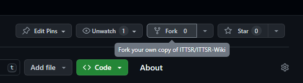
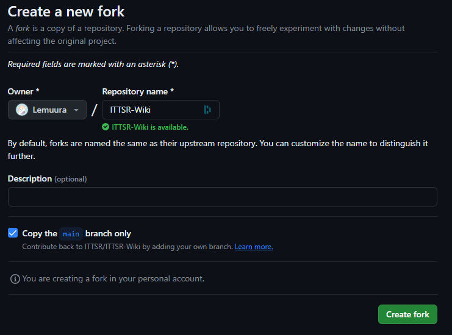
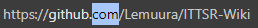
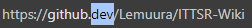
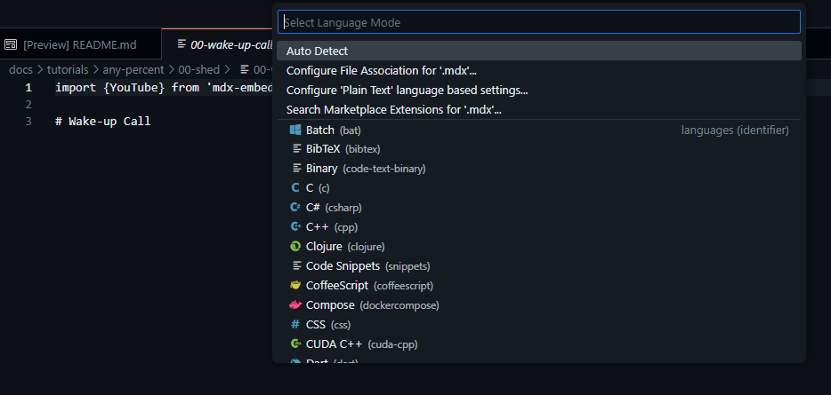
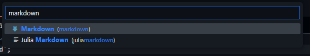
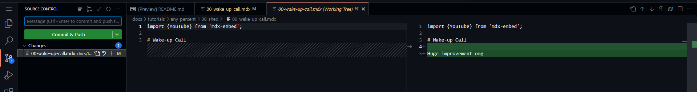
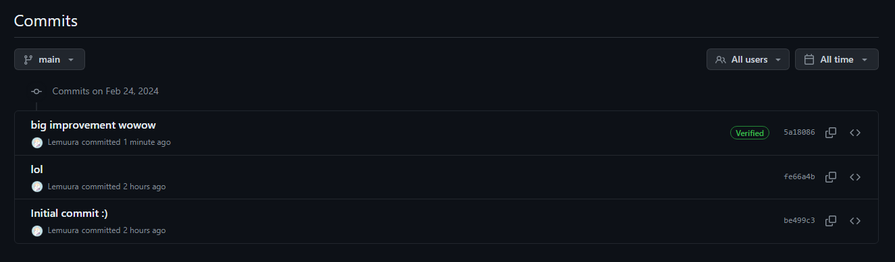
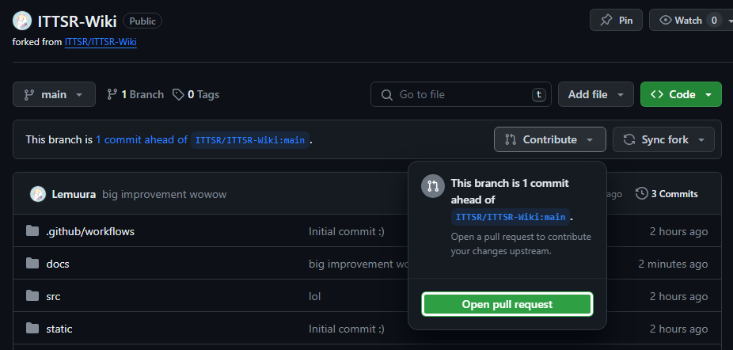

# Easy way

This is largely taken from the TF2SR wiki so big shoutouts to their work!

There are two things you need to do first before you can contribute to the wiki.
- Create a [GitHub](https://github.com) account
- Fork the [Wiki's GitHub repository](https://github.com/ITTSR/ITTSR-Wiki)

Creating a GitHub account should be pretty straight forward.\
But what is that second bullet point?

The general workflow for making contributions on GitHub looks like this:

- You create a copy of the original repository under your own account (This is called "forking" that repository)
- You make changes to your own copy (your "fork")
- You then push those changes back to the original repository via something called a "Pull Request"

## Forking the repository

Creating your own fork of a repository on GitHub is pretty easy. On any repository in the top right there is a row of buttons, and you'll want to press the "Fork" button.

This will take you to a new screen where you can change the name and description if you like.

You'll probably want to leave the checkbox labeled "Copy the `main` branch only" ticked, but you are doing no harm either way. Unticking it just means that you're also copying over any other branches we may have made that you probably don't need.

Once you've hit that green button you have forked the ITTSR Wiki, and you're ready to make some changes!

## Making your changes

Here's a neat little trick. Click on the URL bar at the top of your browser. The URL should look something like `https://github.com/<yourname>/ITTSR-Wiki`. Now, change the `.com` to `.dev`.

 

This will open up a text editor, letting you make your changes directly in the browser. All the markdown files that contain the text within the wiki are located in the `docs` directory.

:::info side note
Chances are that files that end with `.mdx` won't get any nice color highlighting. You can fix this by opening a file that ends with `.mdx`, look in the bottom right where you'll likely find "Plain Text" and click on it. This'll open up a command palette at the top where you can change what language the editor should treat this file as.

Choose "Configure File Association for '.mdx'..." and then type in and choose "Markdown".

You may need to close and reopen the file to see any change.
:::

As you're making changes, you'll notice a number appear next to this weird little icon in the left hand side bar. This is the source control tab and lets you use Git directly from within the text editor.

Clicking on it will change the file browser to show only the files that you have made changes to. You can even click on any file to see a visualization of exactly what you've changed in the file.

:::note side note
If you want to, you can split your changes into multiple different commits by clicking on the little "+" next to the file name in the list. This will add that file to the "staging area", where the next time you click on the big commit button, it will only commit those files you've chosen and leave all the other files alone.

This is not necessary, but can be useful if you're working on multiple things simultaneously and want to keep your commit history neatly organized.
:::

## Submitting your changes

Submitting your changes is a two-step process.
1. Save and record the changes you've made to your own repository (in programmer jargon, "commit" the changes to your "fork").
2. Create a "Pull Request" from your repository onto the original repository.

### Committing to your fork

In order to record the changes in your own repository, all you need to do is press the big green "Commit & Push"[^1] button. You can also add a message to your commit, where you can describe the changes you've made.

[^1]: The reason it's labeled as doing 2 things is because Git usually gives you a lot of optional intermediary steps before you actually record your changes to your repository. It usually goes from your local changes -> Staging area -> Commit -> Push. For our purposes though, we don't need 15 billion different steps to double check that our changes didn't break anything.

Once you've done that, you can double check that it actually went through by going to `github.com/<yourname>/ITTSR-Wiki/commits/main`, which will show you a history of every commit ever made to the repository, including the ones that were made on the main repository before you created your fork.

### Creating a Pull Request

This is the final step in the process. The pull request is now the formal step where you make a **request** to the maintainer of the main repository to **pull** the changes you've made on your fork onto the main repository.

To open a pull request, go to the main page of your repository (`github.com/<yourname>/ITTSR-Wiki`) and check to see if this bar shows up that reads "This branch is `xyz` commit(s) ahead of ITTSR-Wiki:main". If you don't see this, that means that you haven't made a commit to your own repository yet.

Click on the dropdown labeled "Contribute" and then on "Open pull request".

This will take you to the final page, where you can edit the title of the pull request or add extra comments if you'd like. Then all that's left is to click the big green button labeled "Create pull request"

The main repository will do some automatic checks to see if the site will compile properly. If any checks fail, that's usually a skill issue on my end, so you don't need to worry that you actually broke something.

**Congratulations!** You just submitted your changes to the wiki! 

