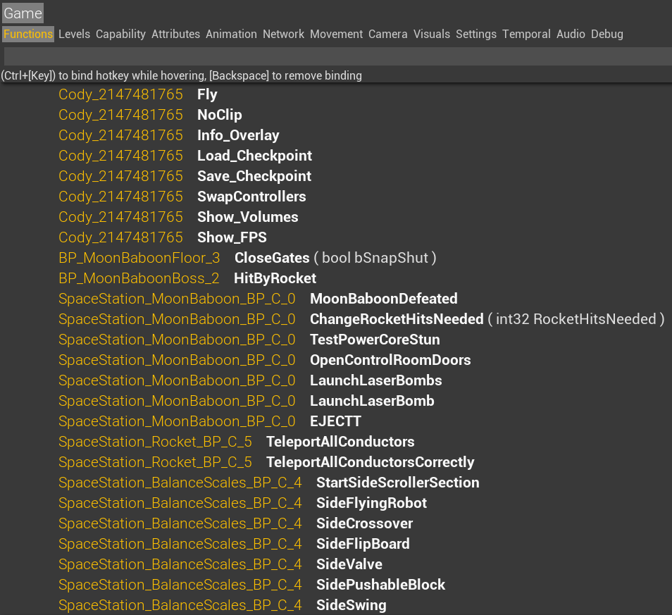

# Functions

This is where all the dev functions are located for the level you're currently in. You'll also see that we have custom dev functions at the top of this list under Cody or May. Those have been added in our various mods for different purposes, generally to make either practice or routing easier.

Developer functions in general are either test functions, or used for debugging purposes. Feel free to mess around with the different functions and see what they do. 

A key thing to mention is that you can bind a hotkey to these functions. To do this, press `Ctrl+[Key]` while hovering over the function. Similarily, press `[Backspave]` while hovering to remove the binding.

