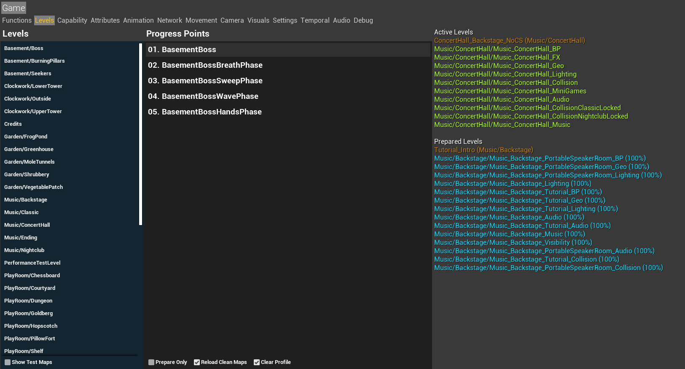

# Levels

This is where you can teleport to all the levels and checkpoints in the game.\
This is probably going to be your most used tab in the dev menu, as being able to teleport to anywhere in the game is invaluable for practice.

Let's break down what's going on here, starting from the left.

## Levels

This is where you can see every level in the game. You navigate through this to get to the checkpoint you're looking for.

:::info Fun fact!
At the top of this list, you can see an unused chapter called "Basement". To start this chapter properly, navigate to `TherapyRoom`, then click the `05. TherapyRoom_Love` progress point.
:::

At the bottom of this list there's a check box that says "Show Test Maps", sadly it doesn't look like this does anything in the shipping build of the game. We do however have a single test map that's always available, which you can find under `PerformanceTestLevel`.

## Progress Points

This is where all the checkpoints for the selected level is located. Some of them have a "(DEV)" prefix, which are, you guessed it, developer checkpoints. Note that not all checkpoints are used in the game, even if they don't have the "(DEV)" prefix.

At the bottom you can see three different check boxes.
- Prepare Only\
When this is checked, it will only "prepare" the checkpoint you're clicking on. This means it loads it into memory, so you don't get a long loading screen.
- Reload Clean Maps
    - Checked\
    When this is checked, it will completely reload the map, and force you through a loading screen. 
    - Unchecked\
    When it's not checked, and you teleport to a checkpoint inside the same level, you don't necessarily get a loading screen. You will however notice persisting changes. Let's say you teleport to the `FirstPortalPlatform` checkpoint in Spaced Out, after you already obtained `FirstPortalPlatformCompleted`. You will see that the cables on the ground are still activated, indicating that you have already completed those portals.
- Clear Profile\
I'm not 100% sure what this does, but it's only available when "Reload Clean Maps" is checked.

## Active Levels

On the right side you will find "Active Levels", which shows you the map assets that are currently loaded. 
In the screenshot above, you can see that we're currently in the "Music_ConcertHall" level, which is known as "Setting the Stage" for us.

## Prepared Levels

Underneath "Active Levels", you will see a section called "Prepared Levels". These are any map assets that has been loaded into memory, and how much they are loaded. If everything is at 100%, you will barely get a loading screen if any when travelling to that level. 

In the screenshot above, you can see that "Music_Backstage" (Also known as "Rehearsal") has been loaded into memory. This makes sense, because our current checkpoint is "ConcertHall_Backstage_NoCS", so it prepares the next level you would travel to to minimize loading times.