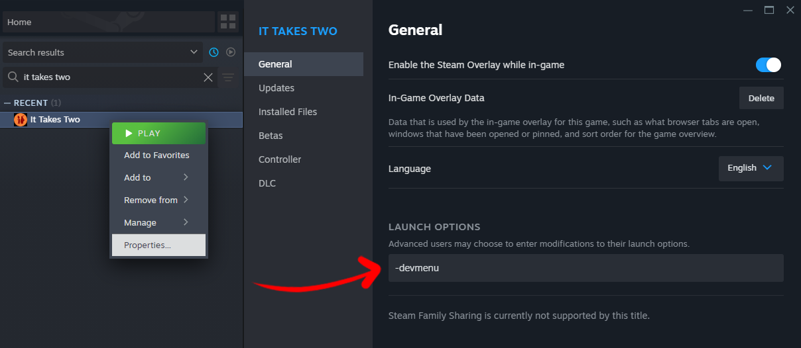
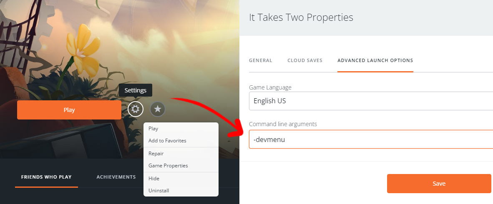
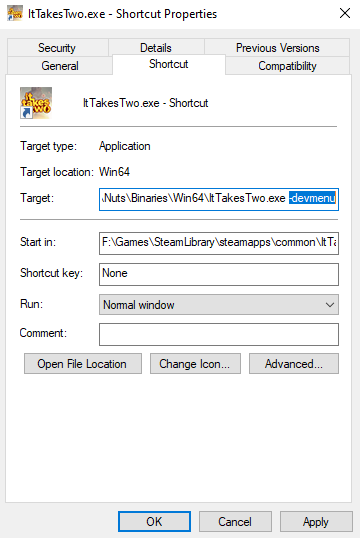
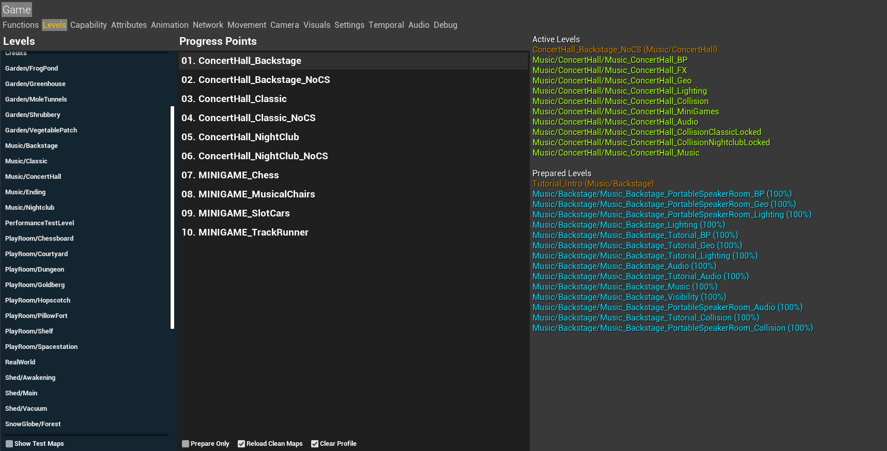

import {YouTube} from 'mdx-embed';

# 🔧 Tools

We have several tools you can use that makes practicing the game a lot easier. Let's start with the dev menu.

:::note
Keep in mind that only PC has access to these tools, there's no way to use any of these on consoles.
:::

## Dev Menu

To access the dev menu, you're gonna need to launch *It Takes Two* with the `-devmenu` command line argument.
There are multiple ways to do this, depending on where you bought your game.

### Steam

Right click *It Takes Two* and select `Properties...`\
Under the **GENERAL** tab, add `-devmenu` into the launch options.

### Origin

Find *It Takes Two* and click the settings cogwheel next to "play", then select `Game Properties`\
Under the **ADVANCED LAUNCH OPTIONS** tab, add `-devmenu` into the command line arguments.

### EA Launcher

Right click *It Takes Two* and select `View properties`\
Add `-devmenu` into the advanced launch options.

:::caution TODO:
Get EA Launcher screenshots for this!!
:::

### Other

:::caution
THIS NEEDS CONFIRMATION
:::

If you have the game through the Xbox Game Pass, there doesn't seem to be anywhere you can set a command line argument.
However, we can try doing it the good old fashioned way.

<Table>

- Find your *It Takes Two* installation directory
- Navigate to `ItTakesTwo\Nuts\Binaries\Win64`
- Right click `ItTakesTwo.exe` and click `Create shortcut`
- Right click the shortcut that was just created, and click `Properties`
- At the end of the `Target:` box, add `-devmenu`\
\
And you should be good to launch the game!
</Table>

### How to open the dev menu

Now that you have enabled the dev menu, go ahead and enter the game.
In your pause menu, you should now have an extra button that says "(DEV) Open Developer Menu". That should open up the `Levels` tab of the dev menu, and this lets you teleport to any checkpoint in the game! Pretty neat right?

<Table>
 

</Table>
The dev menu does have some other information and things that can be helpful when routing, but I'll go into more detail about the dev menu [here](/docs/category/dev-menu). By default the dev menu is only available in the pause menu, but there is a way to enable it in the main menu, which brings us over to...

## Speedtools
